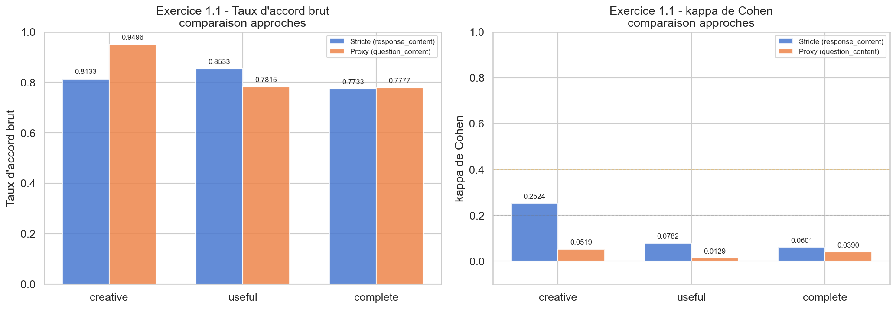
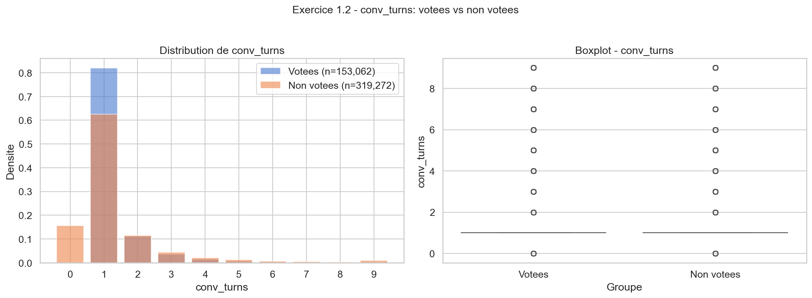
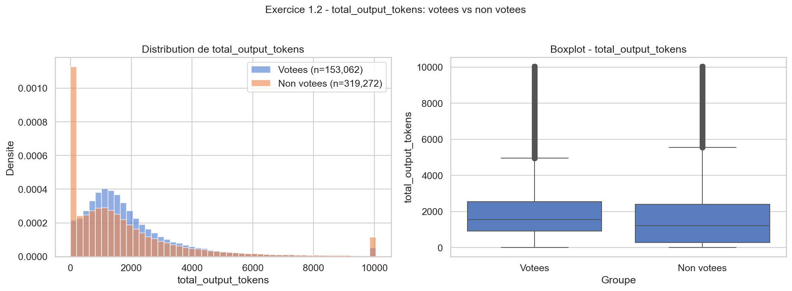
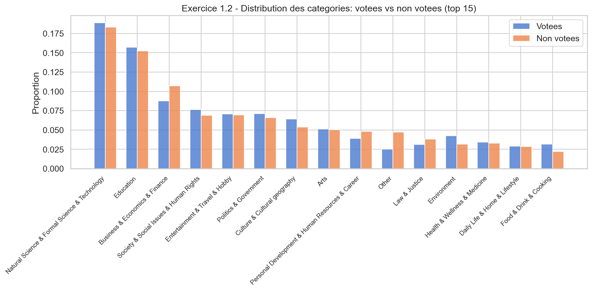
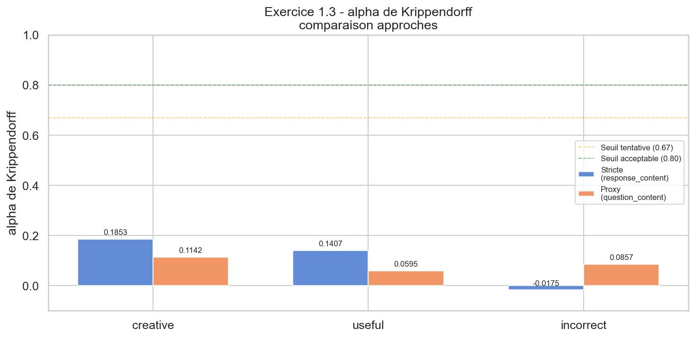

# measuring-llm-creativity

Projet Python modulaire pour :
- charger `comparia-reactions`
- calculer les métriques proposées pour **nouveauté**, **valeur** et **surprise**
- produire des tableaux de synthèse, corrélations simples et comparaisons avec les annotations humaines (`creative`, `useful`, etc.)

## Structure

- `src/creativity_metrics/config.py` : configuration globale
- `src/creativity_metrics/data.py` : chargement et préparation du dataset
- `src/creativity_metrics/text_utils.py` : tokenisation et segmentation en phrases
- `src/creativity_metrics/embeddings.py` : embeddings et similarités
- `src/creativity_metrics/metrics_novelty.py` : métriques de nouveauté
- `src/creativity_metrics/metrics_value.py` : métriques de valeur
- `src/creativity_metrics/metrics_surprise.py` : métriques de surprise
- `src/creativity_metrics/llm_judge.py` : interface facultative pour un LLM juge
- `src/creativity_metrics/pipeline.py` : pipeline principal de calcul
- `src/creativity_metrics/analysis.py` : résumés et corrélations
- `scripts/run_pipeline.py` : exécution de bout en bout
- `scripts/question1_fiabilite.py` : **Question 1 — Fiabilité des jugements humains**

## Installation conseillée

```bash
pip install -r requirements.txt
```

Ou manuellement :

```bash
pip install pandas pyarrow numpy scipy scikit-learn sentence-transformers bert-score rouge-score tqdm datasets krippendorff matplotlib seaborn huggingface_hub statsmodels
```

### Authentification Hugging Face

Les datasets compar:IA sont protégés (gated). Avant de lancer les scripts, il faut :

1. Accepter les conditions d'utilisation sur chaque page HF :
   - [comparia-reactions](https://huggingface.co/datasets/ministere-culture/comparia-reactions)
   - [comparia-votes](https://huggingface.co/datasets/ministere-culture/comparia-votes)
   - [comparia-conversations](https://huggingface.co/datasets/ministere-culture/comparia-conversations)

2. Se connecter via le terminal :
   ```bash
   huggingface-cli login
   ```

## Exécution

### Pipeline de métriques (Exercice 0)

```bash
python scripts/run_pipeline.py \
  --dataset "hf://datasets/ministere-culture/comparia-reactions/reactions.parquet" \
  --sample-size 5000 \
  --output-dir outputs
```

### Question 1 — Fiabilité des jugements humains

```bash
python scripts/question1_fiabilite.py --output-dir outputs/question1
```

## Remarques

- Les métriques utilisant des embeddings exigent un modèle `sentence-transformers`.
- Les métriques `LLM judge` sont optionnelles. Le projet inclut une interface/stub propre, mais **ne lance pas automatiquement d'appel API**.
- Le `N-gram Rarity Score` est calculé ici par défaut **sur le corpus compar:IA lui-même** (baseline empirique). Vous pourrez remplacer cette baseline plus tard par un corpus externe.

---

# Question 1 — Fiabilité des jugements humains

## 1.1 Contexte et problématique

Les votes compar:IA sont issus d'utilisateurs anonymes du grand public, sans recrutement contrôlé ni formation préalable. Les colonnes `creative` (dans `comparia-reactions`) et `conv_creative_a/b` (dans `comparia-votes`) constituent des signaux directs de jugement de créativité, mais leur **fiabilité inter-utilisateurs** n'est pas garantie. Cette section évalue cette fiabilité avant toute modélisation.

### Spécificités du corpus pour l'accord inter-annotateurs (IAA)

Contrairement aux plateformes contrôlées (Prolific, MTurk), compar:IA présente des difficultés spécifiques :
- **Absence de tâche standardisée** : chaque utilisateur pose sa propre question, rendant la comparabilité directe difficile.
- **Biais de sélection** : seuls ~150k votes sur 472k+ conversations → les utilisateurs qui votent ne sont pas représentatifs.
- **Granularité mixte** : les réactions sont au niveau message, les votes au niveau conversation.
- **Un seul annotateur par paire** : chaque `(conversation_pair_id, msg_index, refers_to_model)` est évalué par un unique `visitor_id`. Le champ `question_id` a également une correspondance 1-pour-1 avec `visitor_id` (max = 1 visiteur par `question_id`, confirmé empiriquement).

### Deux approches complémentaires pour l'IAA

Après inspection exhaustive de tous les identifiants du dataset, deux stratégies sont possibles :

**Approche A — Stricte (`response_content`, len > 50)** : Multi-annotation incidentale — deux utilisateurs différents ont reçu *exactement le même texte de réponse* d'un LLM (réponses déterministes ou très courtes). Il s'agit donc du *même objet d'annotation* au sens strict. **57 items avec ≥ 2 visiteurs** et **14 items avec ≥ 3 visiteurs**. Limitation : la grande majorité de ces items sont des réponses courtes ou génériques (< 100 chars), peu représentatives du corpus.

**Approche B — Proxy (`question_content`)** : Même question posée au même modèle par des visiteurs différents. La réponse n'est pas garantie identique (stochasticité du LLM). **778 items avec ≥ 2 visiteurs** et **176 items avec ≥ 3 visiteurs**. Beaucoup plus représentatif du corpus réel.

---

## 1.2 Exercice 1.1 — Accord sur le signal « creative »

### Méthodologie

Pour chaque approche, on regroupe les réactions par l'identifiant d'item correspondant, on sélectionne les items avec ≥ 2 `visitor_id` distincts, puis on forme toutes les paires de visiteurs au sein de chaque item. On calcule sur l'ensemble des paires :

1. **Taux d'accord brut** : proportion de paires avec le même label.
2. **κ de Cohen** : accord corrigé pour le hasard.

### Résultats — Approche A (stricte, `response_content`, len > 50)

57 items avec ≥ 2 visiteurs distincts, 150 paires.

| Label | N paires | Taux d'accord brut | κ de Cohen | Prévalence |
|-------|----------|-------------------|------------|------------|
| `creative` | 150 | **81,33 %** | **0,2524** | — |
| `useful` | 150 | **85,33 %** | **0,0782** | — |
| `complete` | 150 | **77,33 %** | **0,0601** | — |

### Résultats — Approche B (proxy, `question_content`)

778 items avec ≥ 2 visiteurs distincts, 6 589 paires.

| Label | N paires | Taux d'accord brut | κ de Cohen | Prévalence |
|-------|----------|-------------------|------------|------------|
| `creative` | 6 589 | **94,96 %** | **0,0519** | 5,88 % |
| `useful` | 6 589 | **78,15 %** | **0,0129** | 14,15 % |
| `complete` | 6 589 | **77,77 %** | **0,0390** | 13,96 % |



### Interprétation

L'approche stricte (A) donne un κ de Cohen plus élevé pour `creative` (**0,25** vs 0,05), atteignant la zone « fair » de Landis & Koch (1977). Cependant, ce résultat doit être interprété avec prudence : les 57 items multi-annotés via `response_content` sont biaisés vers les réponses courtes (souvent triviales), où l'accord `creative=False` est quasi-universel. Le κ plus élevé reflète en partie la plus forte prévalence des cas non-créatifs dans ce sous-ensemble.

L'approche proxy (B), avec 6 589 paires sur 778 items plus représentatifs, donne des κ dans la zone **« slight »** (< 0,20) pour tous les labels — accord à peine supérieur au hasard, cohérent avec les résultats de la littérature sur les panels crowdsourcés non contrôlés.

**Conclusion commune aux deux approches** : la fiabilité inter-utilisateurs du signal `creative` est faible à modérée, reflétant la subjectivité du concept et l'absence de protocole d'annotation partagé.

### Hypothèses sur le bruit du signal « creative »

**Hypothèse 1 — Subjectivité intrinsèque.** La créativité est un concept plus subjectif que l'utilité. La réponse à « est-ce utile ? » peut s'appuyer sur des critères objectifs (résout-elle le problème ?), tandis que la créativité dépend de normes esthétiques et culturelles personnelles (Amabile, 1983 ; Franceschelli & Musolesi, 2023).

**Hypothèse 2 — Paradoxe de la prévalence.** La faible prévalence du label `creative` (~6 %) amplifie mécaniquement le désaccord mesuré par κ. C'est le paradoxe de la prévalence bien documenté (Feinstein & Cicchetti, 1990).

---

## 1.3 Exercice 1.2 — Biais de sélection des votants

### Méthodologie

Sur les 472 334 conversations de `comparia-conversations`, seules **153 062 (32,4 %)** ont reçu un vote dans `comparia-votes`. Nous analysons si les conversations votées sont représentatives du corpus global en comparant les distributions de trois variables : `conv_turns` (nombre de tours), `total_output_tokens` (somme des tokens de sortie des deux modèles), et `categories` (catégories thématiques).

Pour chaque variable numérique, nous réalisons :
- Un **test de Mann-Whitney U** (test non paramétrique de différence de distributions)
- Un **test de Kolmogorov-Smirnov** à deux échantillons
- Le calcul du **rank-biserial r** comme mesure de taille d'effet

Pour les catégories, un **test du χ²** d'indépendance avec le **V de Cramér**, calculé sur **l'ensemble des 85 catégories** présentes dans le corpus (la visualisation est restreinte aux 15 plus fréquentes pour la lisibilité).

### Résultats

| Variable | Moy. votées | Moy. non votées | Méd. votées | Méd. non votées | KS (D) | p-value | Rank-biserial r |
|----------|-------------|-----------------|-------------|-----------------|--------|---------|-----------------------|
| `conv_turns` | 1,34 | 1,38 | 1,00 | 1,00 | 0,1553 | < 10⁻³⁰⁰ | −0,0839 |
| `total_output_tokens` | 2 056 | 2 005 | 1 554 | 1 212 | 0,1901 | < 10⁻³⁰⁰ | −0,1783 |
| `categories` (χ², 85 cat.) | — | — | — | — | χ² = 6 685 | < 10⁻³⁰⁰ | V = 0,0809 |







### Interprétation

Tous les tests sont significatifs (p ≈ 0), ce qui est attendu avec des échantillons de cette taille (n > 150k et n > 319k). L'interprétation doit donc se fonder sur les **tailles d'effet**, pas sur les p-valeurs.

**Nombre de tours (`conv_turns`)** : le rank-biserial r = −0,08 indique un effet **négligeable**. Les médianes sont identiques (1 tour). Les conversations votées et non votées ont des distributions de tours très similaires.

**Tokens de sortie (`total_output_tokens`)** : le rank-biserial r = −0,18 indique un effet **faible mais détectable**. Les conversations votées ont une médiane plus élevée (1 554 vs 1 212 tokens), ce qui suggère que les utilisateurs votent plus volontiers lorsque les réponses sont substantielles. Cela constitue un **biais de sélection modéré** : les modèles avec des réponses plus longues pourraient être sur-représentés dans les classements.

**Catégories thématiques** : le V de Cramér = 0,08 indique une association **très faible**. La distribution des catégories est globalement similaire entre conversations votées et non votées.

### Implications pour la généralisabilité

Le biais de sélection identifié est **statistiquement significatif mais de faible amplitude**. La principale source de biais est liée à la longueur des réponses. Ce biais pourrait affecter les classements Bradley-Terry (Question 2) en favorisant les modèles verbeux. Une **pondération inverse par propensité au vote** (IPW) pourrait partiellement corriger ce biais.

---

## 1.4 Exercice 1.3 — α de Krippendorff

### Méthodologie

Identique à l'exercice 1.1 : les deux approches sont appliquées, avec un seuil de ≥ 3 annotateurs distincts. Pour chaque label (`creative`, `useful`, `incorrect`), on construit la matrice de fiabilité annotateurs × items (avec NaN pour les cellules non renseignées) et on calcule le **α de Krippendorff** en mesure nominale.

### Résultats — Approche A (stricte, `response_content`, len > 50, ≥ 3 visiteurs)

14 items retenus, 51 annotateurs.

| Label | α de Krippendorff | N annotateurs | N items |
|-------|-------------------|---------------|---------|
| `creative` | **0,1853** | 51 | 14 |
| `useful` | **0,1407** | 51 | 14 |
| `incorrect` | **−0,0175** | 51 | 14 |

### Résultats — Approche B (proxy, `question_content`, ≥ 3 visiteurs)

176 items retenus, 571 annotateurs.

| Label | α de Krippendorff | N annotateurs | N items | Complétude |
|-------|-------------------|---------------|---------|------------|
| `creative` | **0,1142** | 571 | 176 | 0,92 % |
| `useful` | **0,0595** | 571 | 176 | 0,92 % |
| `incorrect` | **0,0857** | 571 | 176 | 0,92 % |



### Interprétation

Selon les seuils de Krippendorff (2011) :
- α ≥ 0,80 : fiabilité acceptable pour des conclusions solides
- 0,67 ≤ α < 0,80 : fiabilité tentative
- α < 0,67 : données **non fiables** pour des conclusions fermes

L'approche stricte (A) donne un α légèrement plus élevé pour `creative` (0,185 vs 0,114), mais tous les résultats sont **très en dessous du seuil de fiabilité de 0,67**. L'α négatif pour `incorrect` dans l'approche A indique un désaccord systématique, probablement dû à la très faible taille de l'échantillon (14 items) et à la rareté du label.

L'approche proxy (B) confirme que, sur 176 items avec ≥ 3 annotateurs, les jugements humains sont essentiellement **non reproductibles** (α < 0,12 pour tous les labels).

### Limites communes aux deux approches

1. **Très faible complétude de la matrice** : chaque annotateur n'a évalué qu'une infime fraction des items — la majorité des cellules sont NaN, ce qui rend l'estimation du α extrêmement bruitée.
2. **Échantillons réduits** : l'approche stricte n'a que 14 items, l'approche proxy 176. Les deux limitent la puissance statistique.
3. **Absence de protocole** : sans formation des annotateurs ni guidelines partagées, l'accord inter-annotateurs est structurellement faible dans ce type de panel crowdsourcé.

### Comparaison avec la littérature

Zheng et al. (2023) rapportent des accords modérés à substantiels pour les préférences globales dans les chatbot arenas, mais les qualificatifs fins comme la créativité sont rarement étudiés isolément. Nos résultats confirment que les jugements de créativité dans un contexte non contrôlé sont significativement plus bruités que les jugements de préférence simple.

---

## Références

- Landis, J. R. & Koch, G. G. (1977). The Measurement of Observer Agreement for Categorical Data. *Biometrics*, 33(1), 159-174.
- Krippendorff, K. (2011). Computing Krippendorff's Alpha-Reliability.
- Amabile, T. M. (1983). *The Social Psychology of Creativity*.
- Feinstein, A. R. & Cicchetti, D. V. (1990). High agreement but low kappa: I. The problems of two paradoxes. *Journal of Clinical Epidemiology*, 43(6), 543-549.
- Franceschelli, G. & Musolesi, M. (2023). On the Creativity of Large Language Models. *ArXiv 2304.00008*.
- Zheng, L. et al. (2023). Judging LLM-as-a-Judge with MT-Bench and Chatbot Arena. *ArXiv 2306.05685*.
